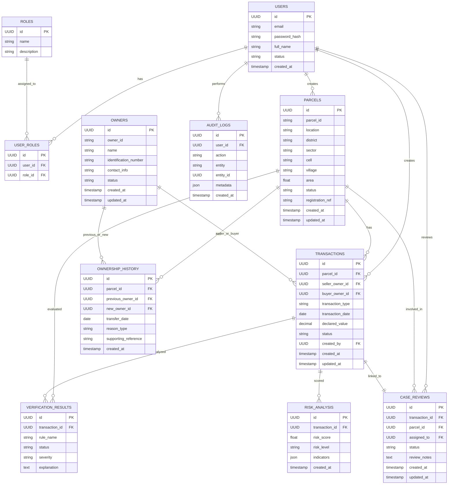

# Entity Relationship Diagram (ERD)

## Conceptual ERD

## Design notes

- The schema is normalized around transactions, parcels, owners, and reviews.
- Ownership history is tracked separately from current ownership records to support temporal auditing.
- Rule results and AI risk outputs are stored independently to preserve explainability and evidence.
- Audit logs are append-only in practice and capture key human/system actions without storing sensitive personal secrets.
